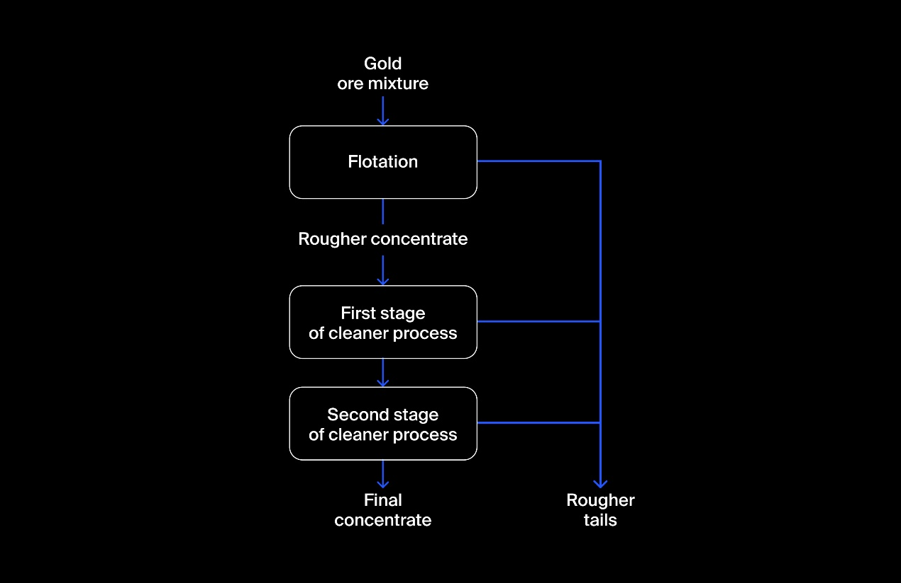
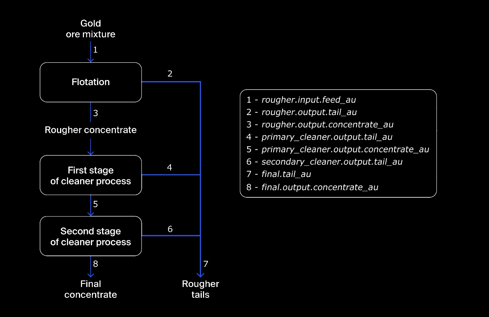

**Task statement**

Prepare a prototype of a machine learning model for Zyfra. The company
develops efficiency solutions for heavy industry.

The model should predict the amount of gold recovered from gold ore. You
have the data on extraction and purification.

The model will help to optimize the production and eliminate
unprofitable parameters.

You need to:

1.  Prepare the data;

2.  Perform data analysis;

3.  Develop and train a model.

To complete the project, you may want to use documentation from
*pandas*, *matplotlib,* and *sklearn.*

The next lesson is about the ore purification process. You will pick the
information that is important for the model development.

Below is a description on gold processing

# Technological Process

##### How is gold extracted from ore? Let\'s look into the process stages.

Mined ore undergoes primary processing to get the ore mixture or rougher
feed, which is the raw material for flotation (also known as the rougher
process). After flotation, the material is sent to two-stage
purification.

Let\'s break down the process:

**1. Flotation**

Gold ore mixture is fed into the float banks to obtain rougher Au
concentrate and rougher tails (product residues with a low concentration
of valuable metals).

The stability of this process is affected by the volatile and
non-optimal physicochemical state of the flotation pulp (a mixture of
solid particles and liquid).

**2. Purification**

The rougher concentrate undergoes two stages of purification. After
purification, we have the final concentrate and new tails.

## Data description

**Technological process**

-   *Rougher feed* --- raw material

-   *Rougher additions* (or *reagent additions*) --- flotation reagents:
    *Xanthate, Sulphate, Depressant*

    -   *Xanthate* --- promoter or flotation activator;

    -   *Sulphate* --- sodium sulphide for this particular process;

    -   *Depressant* --- sodium silicate.

-   *Rougher process* --- flotation

-   *Rougher tails* --- product residues

-   *Float banks* --- flotation unit

-   *Cleaner process* --- purification

-   *Rougher Au* --- rougher gold concentrate

-   *Final Au* --- final gold concentrate

**Parameters of stages**

-   *air amount --- volume of air*

-   *fluid levels*

-   *feed size* --- feed particle size

-   *feed rate*

## Feature naming

Here\'s how you name the features:

\[stage\].\[parameter_type\].\[parameter_name\]

Example: rougher.input.feed_ag

Possible values for \[stage\]:

-   *rougher ---* flotation

-   *primary_cleaner* --- primary purification

-   *secondary_cleaner* --- secondary purification

-   *final* --- final characteristics

Possible values for \[parameter_type\]:

-   *input* --- raw material parameters

-   *output* --- product parameters

-   *state* --- parameters characterizing the current state of the stage

-   *calculation ---* calculation characteristics

## Recovery calculation

You need to simulate the process of recovering gold from gold ore.

Use the following formula to simulate the recovery process:

where:

-   *C* --- share of gold in the concentrate right after flotation (for
    finding the rougher concentrate recovery)/after purification (for
    finding the final concentrate recovery)

-   *F* --- share of gold in the feed before flotation (for finding the
    rougher concentrate recovery)/in the concentrate right after
    flotation (for finding the final concentrate recovery)

-   *T* --- share of gold in the rougher tails right after flotation
    (for finding the rougher concentrate recovery)/after purification
    (for finding the final concentrate recovery)

To predict the coefficient, you need to find the share of gold in the
concentrate and the tails. Note that both final and rougher concentrates
matter.

## Evaluation metric

To solve the problem, we will need a new metric. It is called **sMAPE,**
symmetric Mean Absolute Percentage Error.

It is similar to MAE, but is expressed in relative values instead of
absolute ones. Why is it symmetrical? It equally takes into account the
scale of both the target and the prediction.

Here's how *sMAPE* is calculated:

Denotation:

-   Value of target for the observation with the *i* index in the sample
    used to measure quality.

-   Value of prediction for the observation with the *i* index, for
    example, in the test sample.

-   Number of observations in the sample.

-   Summation over all observations of the sample (***i*** takes values
    from 1 to *N*).

We need to predict two values:

1.  rougher concentrate recovery rougher.output.recovery

2.  final concentrate recovery final.output.recovery

The final metric includes the two values:

# 

# Project description

The data is stored in three files:

-   gold_recovery_train.csv --- training dataset
    [download](https://code.s3.yandex.net/datasets/gold_recovery_train.csv)

-   gold_recovery_test.csv --- test dataset
    [download](https://code.s3.yandex.net/datasets/gold_recovery_test.csv)

-   gold_recovery_full.csv --- source dataset
    [download](https://code.s3.yandex.net/datasets/gold_recovery_full.csv)

Data is indexed with the date and time of acquisition (date feature).
Parameters that are next to each other in terms of time are often
similar.

Some parameters are not available because they were measured and/or
calculated much later. That\'s why, some of the features that are
present in the training set may be absent from the test set. The test
set also doesn\'t contain targets.

The source dataset contains the training and test sets with all the
features.

You have the raw data that was only downloaded from the warehouse.
Before building the model, check the correctness of the data. For that,
use our instructions.

## Project instructions

**1. Prepare the data**

1.1. Open the files and look into the data.

Path to files:

-   */datasets/gold_recovery_train.csv*

-   */datasets/gold_recovery_test.csv*

-   */datasets/gold_recovery_full.csv*

1.2. Check that recovery is calculated correctly. Using the training
set, calculate recovery for the rougher.output.recovery feature. Find
the *MAE* between your calculations and the feature values. Provide
findings.

1.3. Analyze the features not available in the test set. What are these
parameters? What is their type?

1.4. Perform data preprocessing.

**2. Analyze the data**

2.1. Take note of how the concentrations of metals (*Au, Ag, Pb*) change
depending on the purification stage.

2.2. Compare the feed particle size distributions in the training set
and in the test set. If the distributions vary significantly, the model
evaluation will be incorrect.

2.3. Consider the total concentrations of all substances at different
stages: raw feed, rougher concentrate, and final concentrate. Do you
notice any abnormal values in the total distribution? If you do, is it
worth removing such values from both samples? Describe the findings and
eliminate anomalies.

**3. Build the model**

3.1. Write a function to calculate the final *sMAPE* value.

3.2. Train different models. Evaluate them using cross-validation. Pick
the best model and test it using the test sample. Provide findings.

Use these formulas for evaluation metrics:

